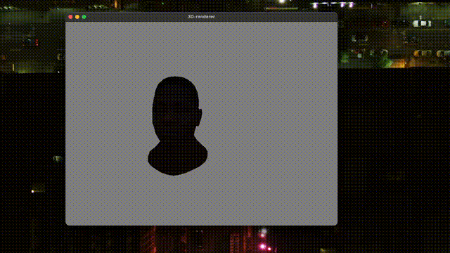

# 3D renderer

Приложение на C++ для рендеринга 3D объектов.

## Демонстрация



## Зависимости

- C++20 (Apple Clang 16 / GCC 12+)
- CMake 3.14 и выше
- GLFW3, GLM, Assimp, OpenGL
- stb_image (включен в репозиторий, `src/stb_image.h`)

macOS:
```bash
brew install glfw glm assimp
```

## Сборка

```bash
cmake -S . -B build -DCMAKE_BUILD_TYPE=Release
cmake --build build -j
```

Запускать из корня репозитория:
```bash
./build/renderer
```

## Управление

| Клавиша | Действие |
|---------|----------|
| W / S | вперед / назад |
| A / D | влево / вправо |
| Q / E | вниз / вверх |
| Мышь | поворот камеры |
| L | точечный свет в позицию камеры (повтор — выкл) |
| = / - | интенсивность света |
| Space | выход |
